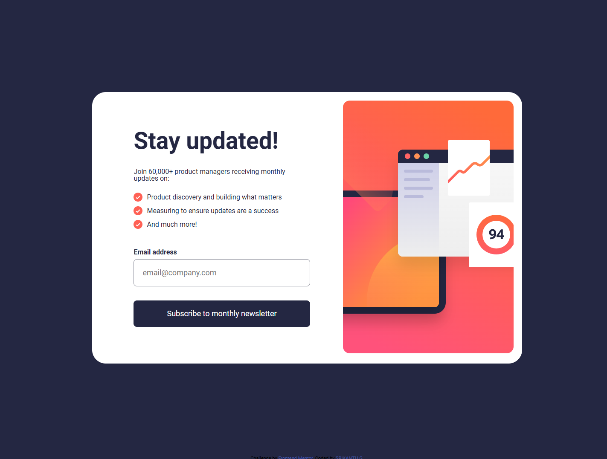

# Frontend Mentor - Newsletter sign-up form with success message solution

This is a solution to the [Newsletter sign-up form with success message challenge on Frontend Mentor](https://www.frontendmentor.io/challenges/newsletter-signup-form-with-success-message-3FC1AZbNrv). Frontend Mentor challenges help you improve your coding skills by building realistic projects.

## Table of contents

- [Overview](#overview)
  - [The challenge](#the-challenge)
  - [Screenshot](#screenshot)
  - [Links](#links)
  - [Built with](#built-with)
  - [Useful resources](#useful-resources)
- [Author](#author)

## Overview

In this project, we will build a responsive and interactive email subscription form for a newsletter.
The goal is to create a user-friendly form that allows users to submit their email addresses and receive
immediate feedback based on their inputs. You'll also focus on ensuring that the form is properly validated
and responsive across different devices. The challenge will guide you through creating a smooth user
experience with clear feedback messages and inntuitive form design, including form validation for email
addresses and responsiveness for mobile and desktop views.

### The challenge

Users should be able to:

- Add their email and submit the form
- See a success message with their email after successfully submitting the form
- See form validation messages if:
  - The field is left empty
  - The email address is not formatted correctly
- View the optimal layout for the interface depending on their device's screen size
- See hover and focus states for all interactive elements on the page

### Screenshot

### Links

- Solution URL: [ solution URL ](https://github.com/shrikanth-dev/newsletter-sign-up-with-success-message-solution?tab=readme-ov-file)
- Live Site URL: [ live site URL ](https://shrikanth-dev.github.io/newsletter-sign-up-with-success-message-solution/)

### Built with

- Semantic HTML5 markup
- CSS custom properties
- Flexbox
- JavaScript

### Useful resources

- (https://www.w3schools.com/html/html_images_picture.asp) - This site helps you learn what is picture element in html, how you can utilize it to display images to different screen sizes.
- (https://www.javatpoint.com/java-email-validation) - This site helps you understand how the email is validated in any form. it gives an idea how to implement your form using JavaScript.

## Author

- Frontend Mentor - [@shrikanth-dev](https://www.frontendmentor.io/profile/yourusername)
- LinkedIn - [@G Srikanth](https://www.linkedin.com/in/g-srikanth-gs)
